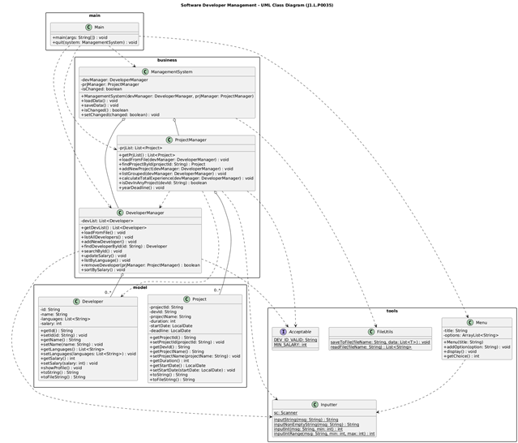
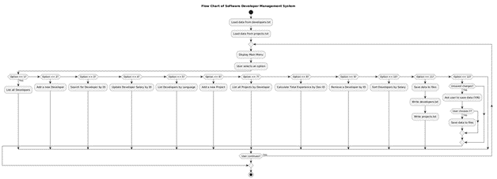
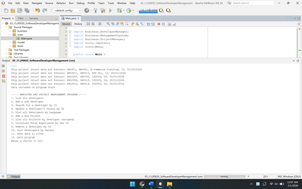

# Developer Project Management System

A Java console-based application for managing software developers and their assigned projects.

The system allows users to manage developer profiles, assign projects, and track developer experience using a menu-driven command-line interface.

---

# System Architecture

The system is designed following Object-Oriented Programming principles with separated modules for business logic, data models, utilities, and program control.



The system contains several core components:

* **DeveloperManager** – handles developer-related operations
* **ProjectManager** – manages project assignments
* **ManagementSystem** – coordinates system operations
* **FileUtils** – handles file input/output
* **Inputter** – processes user input
* **Menu** – provides the command-line interface

---

# System Flow

The following diagram shows the program execution flow.



Program flow:

1. Load data from text files
2. Display the main menu
3. User selects a function
4. Execute the selected operation
5. Optionally save data to files
6. Exit the program

---

# Application Interface

Example of the main menu displayed in the console:



Users can perform multiple operations such as:

* Manage developers
* Manage projects
* Calculate developer experience
* Save and reload data

---

# Features

## Developer Management

* Add new developers
* Search developer by ID
* Update developer salary
* Remove developer
* List developers by programming language
* Sort developers by salary

## Project Management

* Add new project
* Assign project to developer
* List projects grouped by developer
* Calculate developer experience based on project duration
* Display projects ending in a specific year

## Data Persistence

* Load data from text files
* Save updated data to files

---

# Technologies Used

* Java
* Object-Oriented Programming (OOP)
* File Handling
* Regular Expressions
* CLI (Command Line Interface)

---

# Project Structure

```
src
│
├── business
│   ├── DeveloperManager.java
│   ├── ProjectManager.java
│   └── ManagementSystem.java
│
├── model
│   ├── Developer.java
│   └── Project.java
│
├── tools
│   ├── Inputter.java
│   ├── Menu.java
│   ├── FileUtils.java
│   └── Acceptable.java
│
└── main
    └── Main.java
```

---

# How to Run

Clone the repository

```
git clone https://github.com/rainy2309/developer-project-management-system.git
```

Open the project in any Java IDE:

* IntelliJ IDEA
* NetBeans
* VS Code

Run:

```
main/Main.java
```

---

# Learning Objectives

This project demonstrates:

* Object-Oriented Programming design
* Input validation using Regex
* File-based data persistence
* Modular system architecture
* Menu-driven console applications

---

# Future Improvements

* Integrate database (MySQL / PostgreSQL)
* Develop REST API
* Build graphical user interface (GUI)

---

# Author

Student project for practicing Java programming and software system design.
